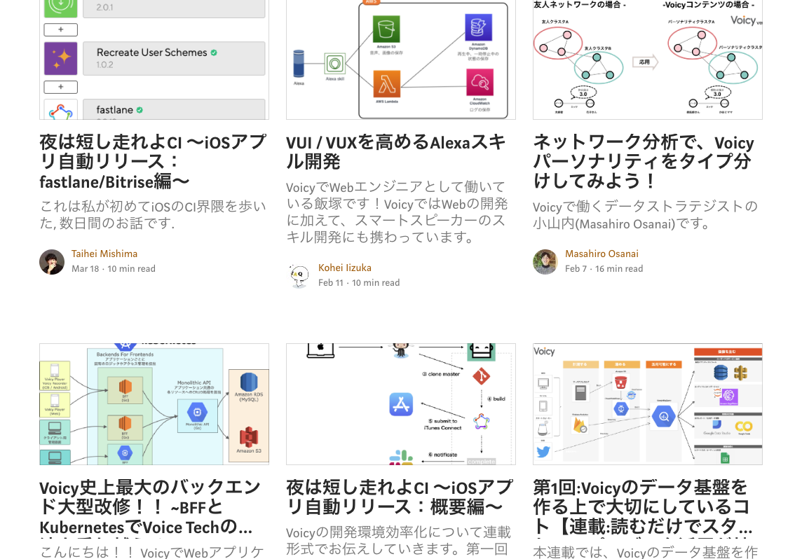

---?image=assets/cover.jpg&size=cover

## Firebase Predictionで始める1歩先を読むグロース戦略
### by Voicy

2019.03.28
  
Firebase Meetup #12 Growth Day

[@koyamauchi](https://github.com/koyamauchi)

---

## 本日のお題目

1. Voicyの紹介
2. 私が考えるグロースへの取り組み方
3. FirebasePredictionってどんなサービス?
4. FPを使い始める準備をしよう！
5. バンバン活用しようぜ！
6. まとめ

+++
## 自己紹介
- 小山内
- Voicy
- データストラテジスト
- データに関連する事は何でもやってます。元マーケ。

---
# [Voicyの紹介](https://gitpitch.com/)
(1/6)

+++
## こんなサービスです!

+++
## エンジニアチームはこんな構成です！

+++
## サービス作り直してます！

---
# 私が考えるグロースへの取り組み方
(2/6)

+++
## リテンションカーブの起点を上げるか? 減少を食い止めるか?のどちらかしかない

+++
## 特に、C向けはユーザーニーズが多様なだけに、きめ細かい体験設計が求められる

+++
## USの方が進んでる。過去の結果を分析-->改善する流れから、詳細の行動を予測-->先回りして対処するのがナウいやり方
- Amptitude
- Leanplume ...etc

---
# そうだ、FirebasePredictionを使ってみよう
---
# FirebasePredictionの役回り
(3/6)
+++
## ざっくり言うと、
- Analyticsのイベントを元に学習して、"ある特定のAnalyticsイベントの発生確率を予測する"
- それによって、施策の精度を上げる事ができる
+++
## ラーメン屋の例... (Day1)
- あなたはラーメン屋を経営しています。ある1人のお客さんが来週もお店に来てくれるか?予測したいとします。
- 友人のとっても賢いデータサイエンティストが、"過去28日の行動データからすると、お客さんAは65%の確率で来週もお店に来るよ!"と教えてくれました。
+++
## ラーメン屋の例... (Day2)
- さらに、"25%の確率でチャーシュー麺を注文するよ!"という事も教えてくれました。"マジかよ何でも教えてくれるじゃん！"と店主は喜び、新メニュー開発することにしました。
- めでたしめでたしとな...
+++
### こんなお友達がいたら良いのになあ....
#### ---> Predictionの出番です

+++
## Analyticsを初めとして各種プロダクトの分析/施策精度を上げる"潤滑油"的な役割。使ってあげて〜

+++
## 実際はCV単価が高いサービス / 利用頻度が高いサービスに向いているかな?という印象です

+++
## 参考になりそうなリソース
- Googleの公式動画
- Qittaの記事(私が書きましたw)
+++
## 自社でデータサイエンスチームが存在して、ゴリゴリにモデルをチューニングできる会社も要らないかも。でも、SaaS的に安定稼働&無料で予測してくれるので、精度を確かめるのは良いかも。
- 
---
# Firebase Predictionを使い始めるまで...
(4/6)
- いくつか注意点があります

+++
## ①何はともあれアクティベートしよう(リスク事項はほとんどないぞ)
- FirebaseAnalyticsを使用していないと、使えない。まだ、使った事ないぜ！という人がもしいたら、是非導入を！※後述するように、setUserIDも他ツールと連携するなら忘れずに....
+++
## ②仕組みを理解する(偉い人に説明できるようにしよう)
### 時間があるので、じっくり紹介するぞ！
### 仕組みをブラックボックスにせずにきっちりと理解する
- リスクへの考え方、FA / TPなどのマトリックスの理解、予測に使用された変数。
- ユーザー体験に直結する部分になるので、仕組みはしっかりと理解し、デメリットも把握した上で、使用する事が重要
- 内容についても詳細に説明する
 - eventログを主な学習データとして、2クラス分類の機械学習モデルが走る。過去の28日間のデータを元にしたクロスバリデーションが走る。
 - めっちゃ簡単に説明すると、毎日過去28日間の行動を起点にして計算を実行する
+++
## ③予測の種類を追加する(アナリティクスのCVしか設定できない)
- コンバージョンの上限は10個 / 予測の上限もある。課金やレベルアップ、友達招待など、ビジネスインパクトの大きい指標を予測対象とするのが吉
---
# めっちゃ活用しようぜ！
(5/6)
+++
## ログと紐付けて分析しようぜ!(BigQueryへのエクスポート&setUserIDを忘れずに....)
- UserIDを紐づける事で、Analyticsと結びつけて分析が可能になる。サービス全体の改善に生かす、BigQuery活用術 (by Voicy)
- 自社データと紐付けたい場合は、BigQueryから転送するのが良いでしょう。UserIDをkeyにすれば、様々なデータと繋がるよ。

+++
## 施策をバンバン打っていこうぜ!(分析とエンゲージメントアップ)
- 具体的な出し先をスクショ交えて投げる / 予測RemoteConfigの切り替えタイミングだけイマイチ分からんので調べる。
- 全員に常に付与されている感じだけど、ユーザープロパティ?RemoteConfig
---
## まとめ
(6/6)
- 準備が大変だけど、色々と応用先がある
- in App Messageって動く?教えて！