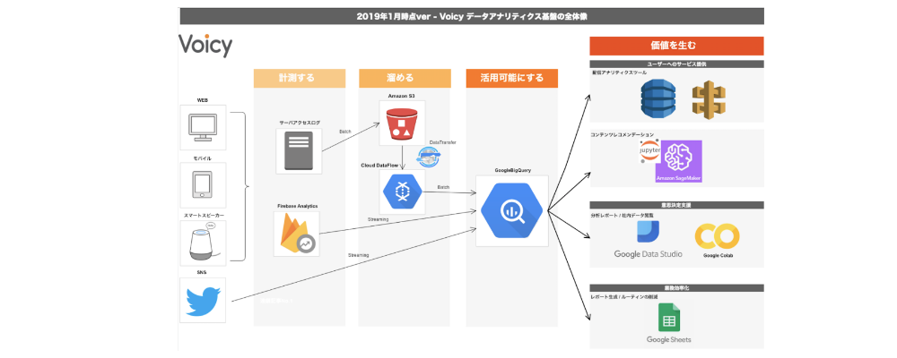
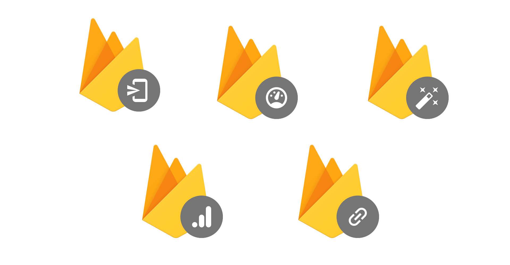
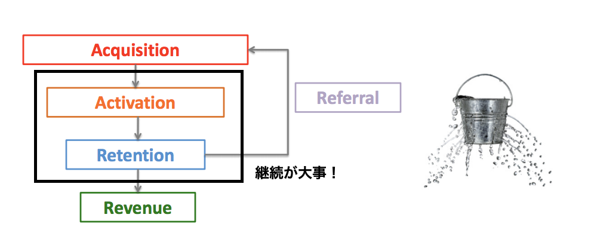
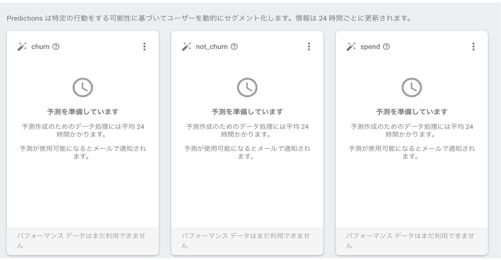
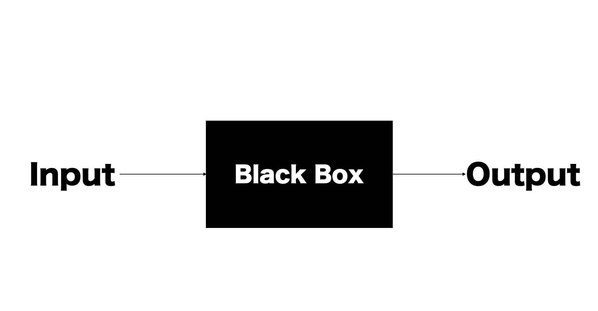
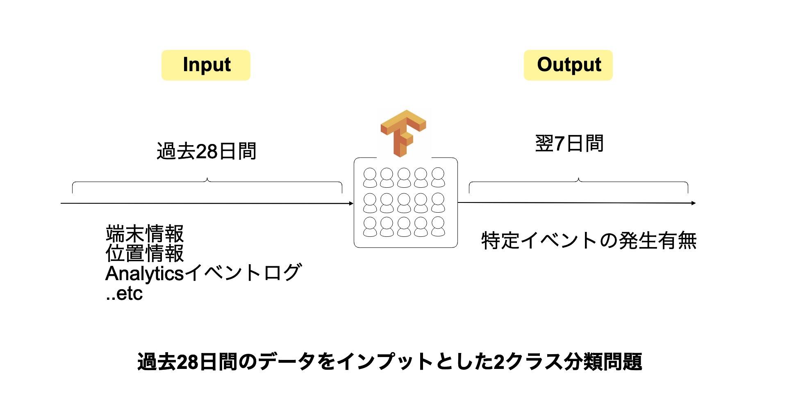
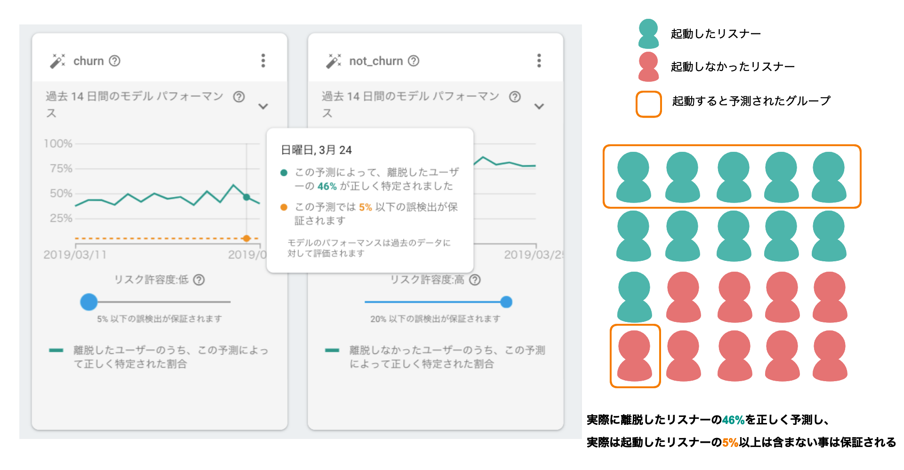
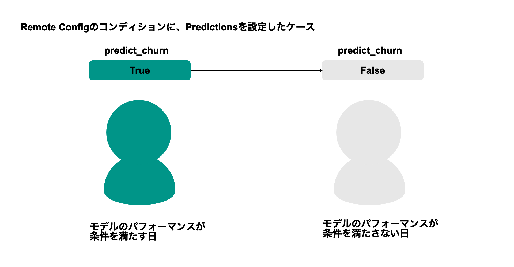
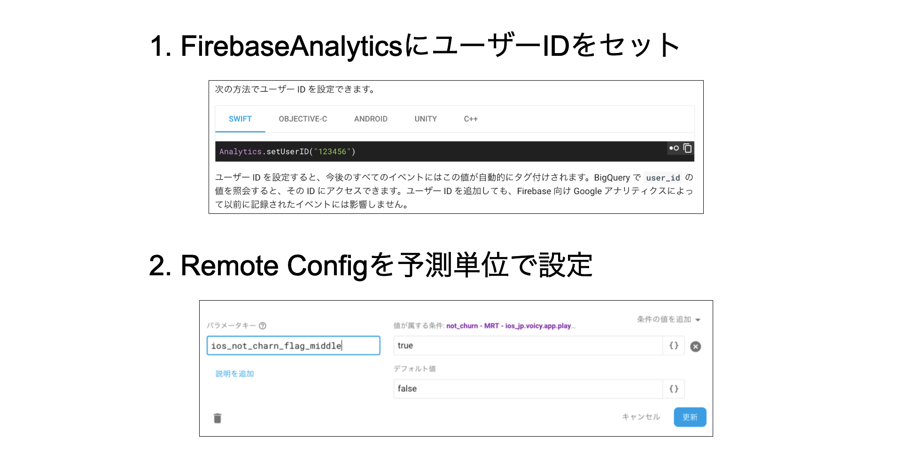

---?image=assets/cover.png

## Firebase Predictionsで始める
## 1歩先を読むグロース戦略
 
@koyamauchi
 
 
2019.03.28
 
Firebase Meetup #12 Growth Day

---?image=assets/cover.png
#### 本日のお題目

1. @color[black](Voicyの紹介)
2. アプリのグロースについて考えてみる
3. Predictionって何?
4. 使い始める準備をしよう！
5. いざアクション！
6. 最後にまとめ

+++?image=assets/introduce_fin.png
+++?image=assets/introduce_2.png
+++
@snap[midpoint span-100]
#### @size[0.8em](今日の発表で得られるもの)
@ol
- @size[1.1em](Predicionsの仕組みが分かる)
 
- @size[1.1em](使い始めるまでに必要な準備 / 活用方法が分かる)
 
- @size[1.1em](明日から使ってみたくなる(多分))
@olend
@snapend
---?image=assets/cover.png

### Voicyの紹介
(1/6)

+++?image=assets/vision_2.png
+++?image=assets/introduction.png
@snap[north-west]
+++
@snap[north-west]
#### Voicyのデータ環境
@size[0.6em](toCアプリのログは、サーバーログとFirebaseAnalyticsを併用して使用)
 
@size[0.6em](音声聴取ログとアプリ内でのアクションログの2つをまとめてBigQueryに投入)
 

@snapend

+++
#### Voicy と Firebase
@size[0.6em](必要に応じて、いくつかのサービスを使用しています)

---?image=assets/cover.png

### アプリのグロースについて考えてみる
(2/6)

+++
#### @size[0.8em](継続率が何よりも重要だというのはよくある話...)
 
 
@size[0.5em](まずはサービスを使い続けてくれる土台作りがダイジ)
+++
@snap[north-west]
#### @size[0.8em](従来の分析と予測型の分析)
@ul
- @size[1.0em](これまで:)
- @size[0.8em](過去の行動を分析して、未来のユーザーにアクションを実行)
- @size[0.8em](-> 離脱してしまったユーザーにアプローチできない & 施策が新規のユーザーに適用可能かは未知数)
 
- @size[1.0em](これから:)
- @size[0.8em](今のユーザーの行動を予測して、そのユーザーにアクションを実行)
- @size[0.8em](-> そもそも離脱自体を防ぐ & コンテキストを捉えた施策が打てる)
@ulend
@snapend
+++?image=assets/prediction_case.png
+++
#### 予測での体験向上を手軽にアプリに取り入れるなら、Firebase Predictionsがオススメ💡
---?image=assets/cover.png
### Predictionsって何?
(3/6)
+++
##### @size[0.7em](まずは公式の紹介動画が分かりやすいので見てみる！)

+++
@snap[midpoint span-100]
#### ざっくり言うと、、 
@size[0.7em](アプリ利用者の翌7日間における、特定イベントの発生予測を行うモデルを作成し、各Firebaseプロダクトで利用可能なセグメントを生成する)
@snapend

+++?image=assets/voicy_case.png
+++?image=assets/ec_app.png
+++?image=assets/game_app.png
+++?image=assets/architecture_1.png
@snap[north-west]
#### @size[0.8em](Predictionsの位置付け)
@snapend
+++
#### いよいよ準備完了！
---?image=assets/cover.png
### 使い始める準備をしよう
(4/6)
+++?image=assets/architecture_2.png
+++
#### ①何はともあれアクティベート!
@size[0.6em](MAU10,000以上 かつ Firebase Analyticsで計測中!無償!)
 
+++
#### ②仕組みを理解する
@size[0.6em](ブラックボックスを排除して、正しく用法と用量を守る)
 
+++
@snap[north-west]
#### 大事なポイント1: 
@size[0.7em](Predictionsは、翌7日間のイベント発生確率を予測する)
@snapend
 
 
 
+++
@snap[north-west]
#### 大事なポイント2: 
@size[0.7em](施策に応じて、最適なリスク許容度を選択することができる)
@snapend
 
 
 
+++
@snap[north-west]
#### 大事なポイント3: 
@size[0.7em](予測精度が低い時は、自動でオーディエンス解除される)
@snapend
 
 

+++
@snap[north span-100]
#### ③その他済ましておきたい下準備いくつか

+++?image=assets/pre_download.png
+++
#### 準備完了!
---?image=assets/cover.png
### いざアクション！🔥
(5/6)
+++?image=assets/architecture_4.png
+++?image=assets/cloud_ab.png
+++?image=assets/in_app_messaging.png
+++?image=assets/cloud_messaging_2.png
+++?image=assets/architecture_3.png
+++?image=assets/database.png
@snap[north span-100]
##### @size[0.8em]("ログ"x"予測"の掛け合わせで、踏み込んだ分析が可能！)
@snapend
+++?image=assets/signal.png
---?image=assets/cover.png
### 最後にまとめ
(6/6)

+++
@snap[midpoint span-100]
@ol
- @size[1.1em](予測をアプリに手軽に取り入れるならおすすめ！)
 
- @size[1.1em](学習の仕組みと、応用方法を把握すれば、リスク管理しつつガシガシ使っていける)
 
- @size[1.1em](今後の取り組みもガシガシ発表していきます！)
@olend
@snapend
---?image=assets/techblog.png
@snap[north span-100]
##### @size[0.8em](続報はこちらにて！)
@snapend
