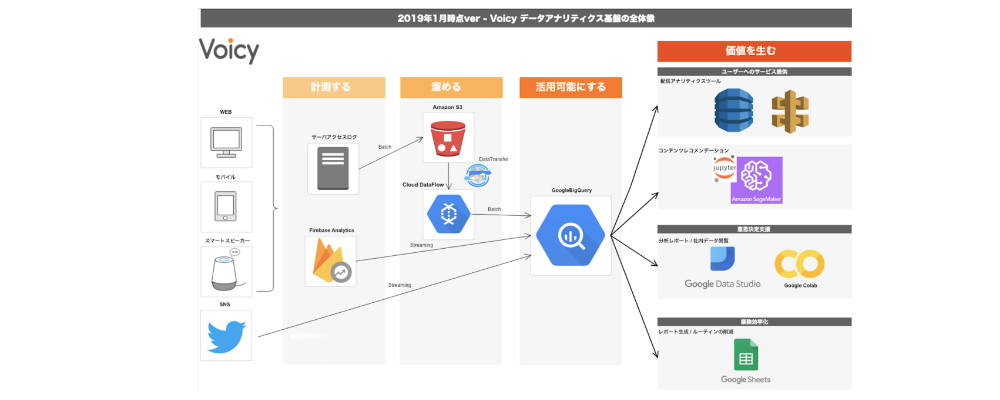
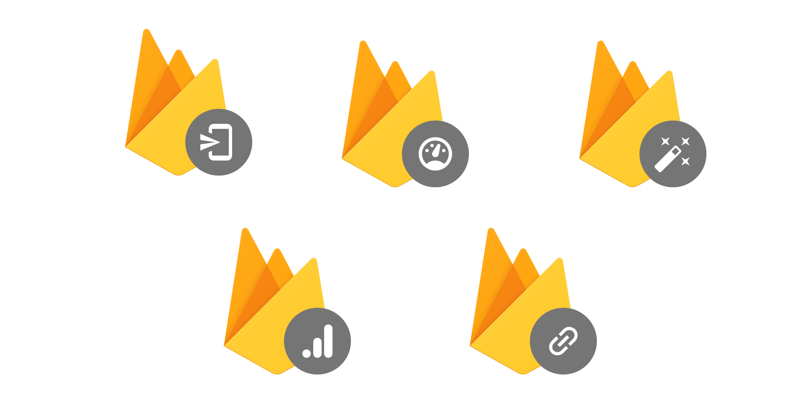
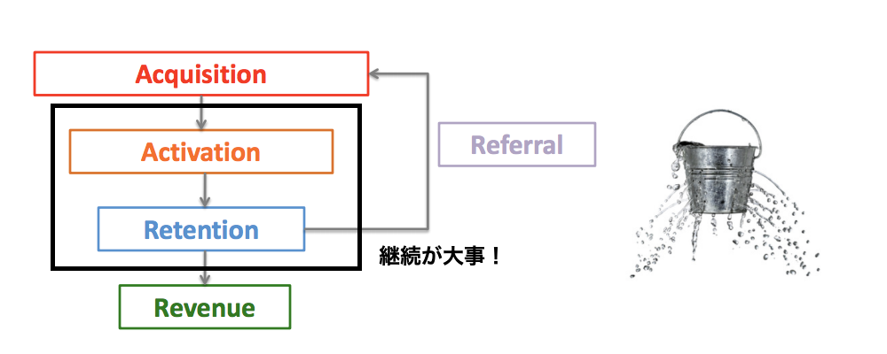
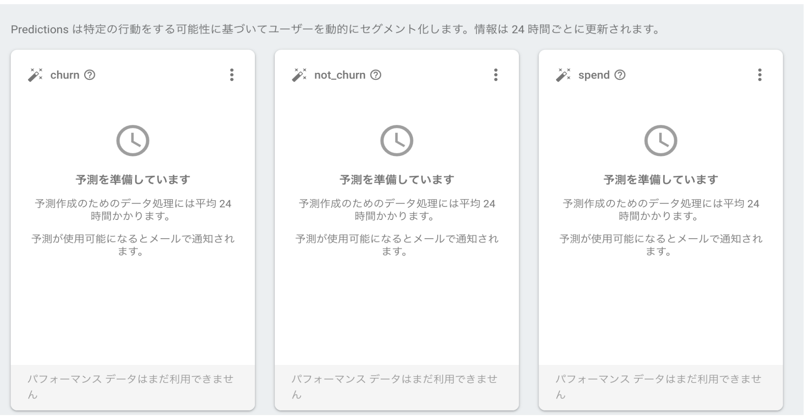
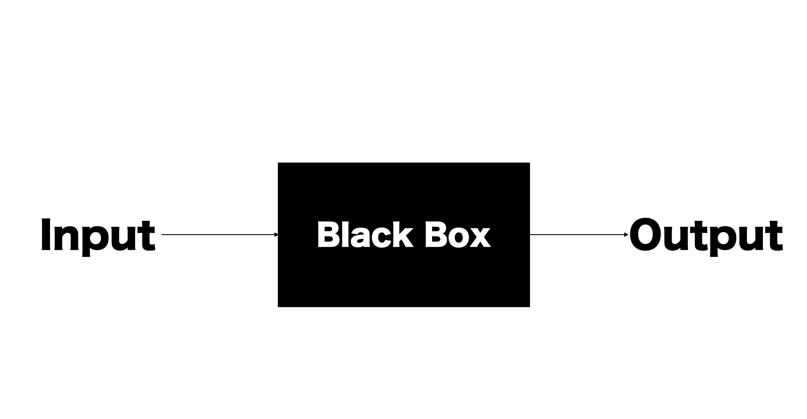
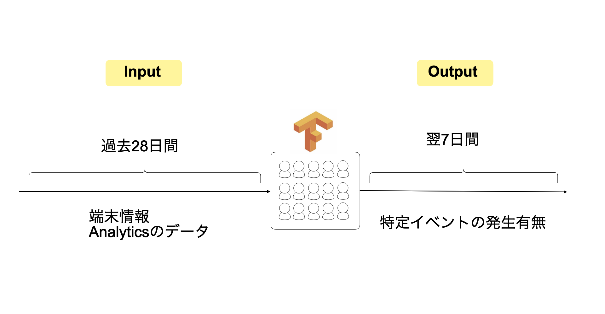
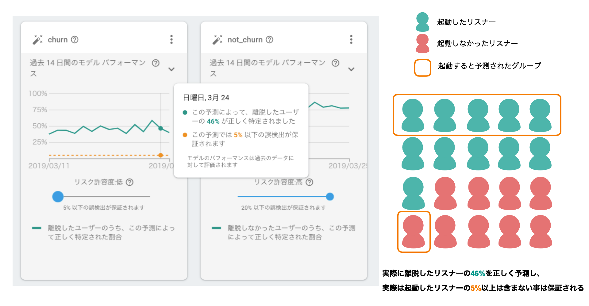
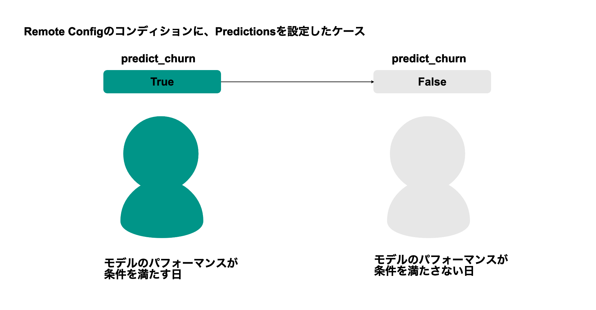
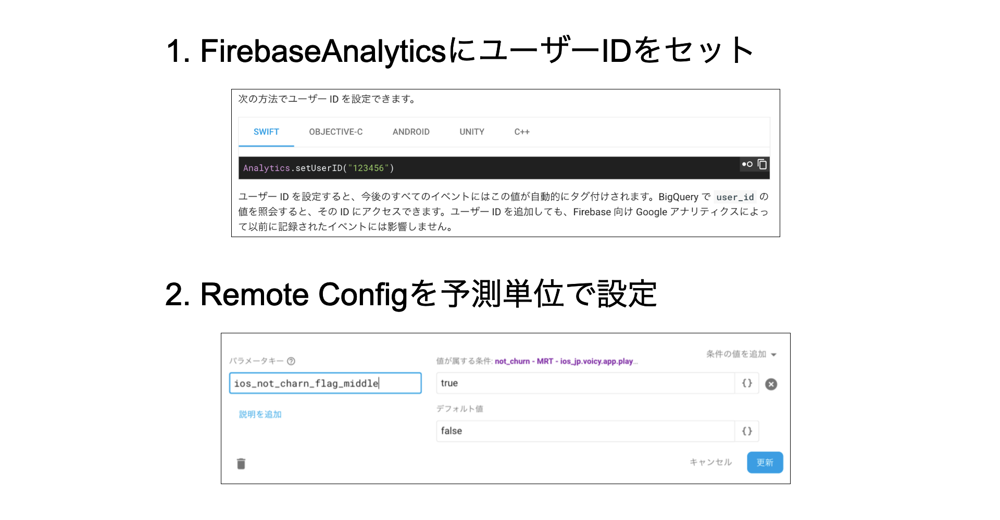

---?image=assets/cover.png

## Firebase Predictionsã§å§‹ã‚ã‚‹
## 1歩先を読むグロース戦略
 
@koyamauchi
 
 
2019.03.28
 
Firebase Meetup #12 Growth Day

---?image=assets/cover.png
#### 本日ã®ãŠé¡Œç›®

1. @color[black](Voicyã®ç´¹ä»‹)
2. アプリグロースãƒãƒƒã‚¯ã‚’シンプルã«è€ƒãˆã‚‹
3. FirebasePredictionã£ã¦ã©ã‚“ãªã‚µãƒ¼ãƒ“ス?
4. FPを使ã„始ã‚る準備をã—よã†ï¼
5. ãƒãƒ³ãƒãƒ³æ´»ç”¨ã—よã†ãœï¼
6. ã¾ã¨ã‚

+++?image=assets/introduce_fin.png
+++?image=assets/introduce_2.png
---
### Voicyã®ç´¹ä»‹
(1/6)

+++?image=assets/voicy_introduction_2.png
+++?image=assets/introduction.png
@snap[north-west]
+++
@snap[north-west]
#### Voicyã®ãƒ‡ãƒ¼ã‚¿ç’°å¢ƒ
@size[0.6em](toCアプリã®ãƒ­ã‚°ã¯ã€ã‚µãƒ¼ãƒãƒ¼ãƒ­ã‚°ã¨FirebaseAnalyticsを併用ã—ã¦ä½¿ç”¨)
 
@size[0.6em](音声è´å–ログã¨ã‚¢ãƒ—リ内ã§ã®ã‚¢ã‚¯ã‚·ãƒ§ãƒ³ãƒ­ã‚°ã®2ã¤ã‚’ã¾ã¨ã‚ã¦BigQueryã«æŠ•å…¥)
 

@snapend

+++
#### Voicy 㨠Firebase
@size[0.6em](å¿…è¦ã«å¿œã˜ã¦ã€ã„ãã¤ã‹ã®ã‚µãƒ¼ãƒ“スを使用ã—ã¦ã„ã¾ã™)

---?image=assets/cover.png

### アプリã®ã‚°ãƒ­ãƒ¼ã‚¹ã«ã¤ã„ã¦è€ƒãˆã¦ã¿ã‚‹
(2/6)

+++
#### @size[0.8em](継続ç‡ãŒä½•ã‚ˆã‚Šã‚‚é‡è¦ã ã¨ã„ã†ã®ã¯ã‚ˆãã‚る話...)
 
 
@size[0.5em](ã¾ãšã¯ã‚µãƒ¼ãƒ“スを使ã„続ã‘ã¦ãれる土å°ä½œã‚ŠãŒãƒ€ã‚¤ã‚¸)
+++
#### @size[0.8em](加ãˆã¦ã€1度離脱ã—ãŸãƒ¦ãƒ¼ã‚¶ãƒ¼ã¯ã‚‚ã†æˆ»ã£ã¦ã“ãªã„ç¾å®Ÿ...)
 
 
@size[0.5em](分æ->ソリューション実行ã®æ®µéšã§æ—¢ã«ãƒ¦ãƒ¼ã‚¶ãƒ¼ã„ãªããªã£ã¦ã‚‹å•é¡Œ)
+++
#### @size[0.8em](行動予測をビジãƒã‚¹ã«å–り込んã§ã„ã‚‹ä¼æ¥­ã¯çµæ§‹ã‚ã‚‹)
 
 
@size[0.5em](Amptitude/Leanplume...etc Prediction)
+++
#### 予測ã§ã®ä½“験å‘上を手軽ã«ã‚¢ãƒ—リã«å–り入れるãªã‚‰ã€Firebase PredictionsãŒã‚ªã‚¹ã‚¹ãƒ¡ğŸ’¡
---?image=assets/cover.png
### Predictionsã£ã¦ä½•?
(3/6)
+++
##### @size[0.7em](ã¾ãšã¯å…¬å¼ã®ç´¹ä»‹å‹•ç”»ãŒåˆ†ã‹ã‚Šã‚„ã™ã„ã®ã§è¦‹ã¦ã¿ã¾ã—ょã†ï¼)

+++
@snap[midpoint span-100]
#### ã–ã£ãり言ã†ã¨ã€ã€ 
@size[0.7em](アプリ利用者ã®ç¿Œ7日間ã«ãŠã‘ã‚‹ã€ç‰¹å®šã‚¤ãƒ™ãƒ³ãƒˆã®ç™ºç”Ÿäºˆæ¸¬ã‚’è¡Œã†ãƒ¢ãƒ‡ãƒ«ã§å­¦ç¿’ã‚’è¡Œã„ã€å„Firebaseプロダクトã§åˆ©ç”¨å¯èƒ½ãªã‚»ã‚°ãƒ¡ãƒ³ãƒˆã‚’生æˆ)
@snapend

+++?image=assets/voicy_case.png
+++?image=assets/ec_app.png
+++?image=assets/game_app.png
+++?image=assets/architecture_1.png
@snap[north-west]
#### @size[0.8em](Predictionsã®ä½ç½®ä»˜ã‘)
@snapend
+++
#### ã„よã„よ準備完了ï¼
---?image=assets/cover.png
### Predictionsを使ã„始ã‚ã‚‹ã¾ã§ã®æº–å‚™
(4/6)
+++?image=assets/architecture_2.png
+++
#### ①何ã¯ã¨ã‚‚ã‚れアクティベート!
@size[0.6em](MAU5,000以上 ã‹ã¤ Firebase Analyticsã§è¨ˆæ¸¬ä¸­! ç„¡å„Ÿ!)
 
+++
#### ②仕組ã¿ã‚’ç†è§£ã™ã‚‹
@size[0.6em](ブラックボックスをæ’除ã—ã¦ã€æ­£ã—ã用法ã¨ç”¨é‡ã‚’守る)
 
+++
@snap[north-west]
#### 大事ãªãƒã‚¤ãƒ³ãƒˆ1: 
@size[0.7em](Predictionsã¯ã€ç¿Œ7日間ã®ã‚¤ãƒ™ãƒ³ãƒˆç™ºç”Ÿç¢ºç‡ã‚’予測ã™ã‚‹)
@snapend
 
 
 
+++
@snap[north-west]
#### 大事ãªãƒã‚¤ãƒ³ãƒˆ2: 
@size[0.7em](施策ã«å¿œã˜ã¦ã€æœ€é©ãªãƒªã‚¹ã‚¯è¨±å®¹åº¦ã‚’é¸æŠã™ã‚‹ã“ã¨ãŒã§ãã‚‹)
@snapend
 
 
 
+++
@snap[north-west]
#### 大事ãªãƒã‚¤ãƒ³ãƒˆ3: 
@size[0.7em](予測精度ãŒä½ã„時ã¯ã€è‡ªå‹•ã§ã‚ªãƒ¼ãƒ‡ã‚£ã‚¨ãƒ³ã‚¹è§£é™¤ã•ã‚Œã‚‹)
@snapend
 
 

+++
@snap[north span-100]
#### â‘¢ãã®ä»–済ã¾ã—ã¦ãŠããŸã„下準備ã„ãã¤ã‹

+++?image=assets/pre_download.png
+++
#### 準備完了!
---?image=assets/cover.png
### ã„ã–アクションï¼ğŸ”¥
(5/6)
+++?image=assets/architecture_4.png
+++?image=assets/cloud_ab.png
+++?image=assets/in_app_messaging.png
+++?image=assets/cloud_messaging_2.png
+++?image=assets/architecture_3.png
+++?image=assets/database.png
@snap[north span-100]
##### @size[0.8em]("ログ"x"予測"ã®æ›ã‘åˆã‚ã›ã§ã€è¸ã¿è¾¼ã‚“ã åˆ†æãŒå¯èƒ½ï¼)
@snapend
---?image=assets/cover.png
### 最後ã«ã¾ã¨ã‚
(6/6)

+++
@snap[midpoint span-100]
@ol
- @size[1.1em](準備ãŒå¤§å¤‰ã ã‘ã©ã€è‰²ã€…ã¨å¿œç”¨å…ˆ)
 
- @size[1.1em](準備ãŒå¤§å¤‰ã ã‘ã©ã€è‰²ã€…ã¨å¿œç”¨å…ˆ)
 
- @size[1.1em](準備ãŒå¤§å¤‰ã ã‘ã©ã€è‰²ã€…ã¨å¿œç”¨å…ˆ)
@olend
@snapend
---
##### @size[0.8em](Voicyã§ã¯ã€å…±ã«éŸ³å£°ã®æœªæ¥ã‚’作る仲間を募集ã—ã¦ã„ã¾ã™ï¼)
 